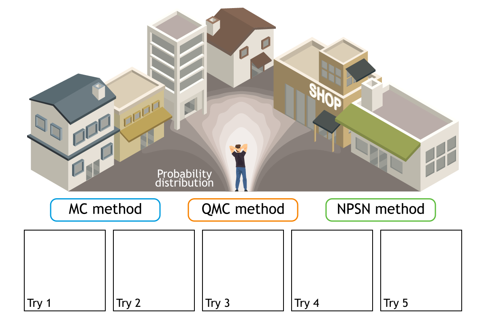
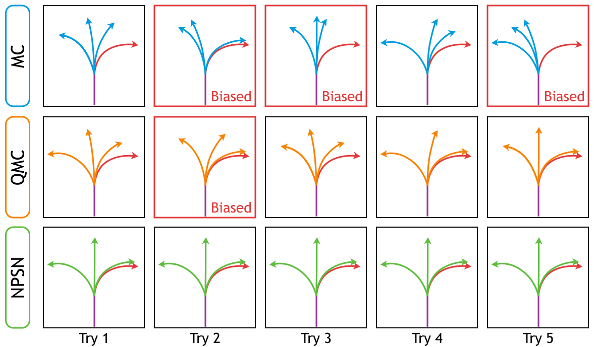
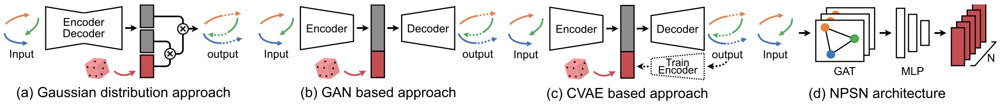

## Non-Probability Sampling Network for Stochastic Human Trajectory Prediction
This repository contains the code for the NPSN method applied to the trajectory forecasting models.

**[Non-Probability Sampling Network for Stochastic Human Trajectory Prediction](https://inhwanbae.github.io/publication/npsn/)**
<br>
<a href="https://InhwanBae.github.io/">Inhwan Bae</a>,
Jin-Hwi Park, and
<a href="https://scholar.google.com/citations?user=Ei00xroAAAAJ">Hae-Gon Jeon</a>
<br>Accepted to 
<a href="https://cvpr2022.thecvf.com/">CVPR 2022</a>

<div align='center'>
  
  
</div>


## 🎲 NPSN method 🎲
* Inferences of all stochastic models are biased toward the random sampling, <br> fail to generate a set of realistic paths from finite samples.
* Quasi-Monte Carlo method, ensuring uniform coverage on the sampling space, <br>improves all the multimodal prediction results.
* Non-Probability Sampling Network (NPSN), a very small network that generates purposive sample sequences, <br> can significantly improve both the prediction accuracy (up to 60%) and reliability.
* Simply replacing one line of code on random sampling([`click`](https://github.com/InhwanBae/NPSN/blob/main/npsn/sampler.py#L27)) with our NPSN([`here`](https://github.com/InhwanBae/NPSN/blob/main/npsn/sampler.py#L39))!

<div align='center'></div>


## Model Training
### Setup
**Environment**
<br>All models were trained and tested on Ubuntu 18.04 with Python 3.7 and PyTorch 1.7.1 with CUDA 10.1.

**Dataset**
<br>Preprocessed [ETH](https://data.vision.ee.ethz.ch/cvl/aem/ewap_dataset_full.tgz) and [UCY](https://graphics.cs.ucy.ac.cy/research/downloads/crowd-data) datasets are included in this repository, under `./dataset/`. 
The train/validation/test splits are the same as those fond in [Social-GAN](https://github.com/agrimgupta92/sgan).

**Baseline models**
<br>This repository supports three baseline models: [**Social-STGCNN**](https://arxiv.org/abs/2002.11927), [**SGCN**](https://arxiv.org/abs/2104.01528) and [**PECNet**](https://arxiv.org/abs/2004.02025).
We have included model source codes from their official GitHub in the `./baselines/` folder. 


### Train NPSN
To train our NPSN on the ETH and UCY datasets at once, we provide a bash script `train.sh` for a simplified execution.
```bash
./train.sh -b <baseline_model>
```
For example, you can run the following command to train our NPSN with SGCN baseline with the best configuration.
```bash
./train.sh -b sgcn
```
We provide additional arguments for experiments: 
```bash
./train.sh -t <experiment_tag> -b <baseline_model> -d <space_seperated_dataset_string> -i <space_seperated_gpu_id_string>

# Examples
./train.sh -b sgcn -d "hotel" -i "1"
./train.sh -t exp1 -b stgcnn -d "hotel" -i "1"
./train.sh -t npsn -b pecnet -d "eth hotel univ zara1 zara2" -i "0 0 0 0 0"
```

If you want to train the model with custom hyper-parameters, use `train_npsn.py` instead of the script file.
```bash
python train_npsn.py --baseline <baseline_model> --tag <experiment_tag> --dataset <dataset_name> \
--num_samples <number_of_samples> --obs_len <observation sequence length> --pred_len <prediction sequence length> \
--batch_size <minibatch_size> --num_epochs <number_of_epochs> --lr <learning_rate> --lr_sh_rate <number_of_steps_to_drop_lr> \
--clip_grad <gradient_clipping> --gpu_num <gpu_id> --use_lrschd 
```


### Reproducibility
All the experiments in this work are performed with *seed=0*, strictly following [PyTorch Reproducibility](https://pytorch.org/docs/stable/notes/randomness.html).
<br>We checked that the same results were reproduced on RTX 2080Ti (Ubuntu 18.04, PyTorch 1.7.1, CUDA 10.1) and RTX 3090 (Ubuntu 20.04, PyTorch 1.9.0, CUDA 11.1) environments. 


## Model Evaluation
### Pretrained Models
**Baseline models**
<br>We use model source codes and pretrained weights from their official GitHub.
Pretrained baseline models are included in the `./pretrained/` folder. 
<details>
  <summary><b>Important note for PECNet (Click to expand)</b></summary>

  * **Data Split**
  <br>For an apple-to-apple comparison, we used the *train-validation-test* split of Social-GAN. We used the same data split strategy for all other baseline models.

  * **Dataloader**
  <br>We used Social-GAN's dataloader instead of their pre-processed pickle file. To work similarly to PECNet's original dataloader, we wrote codes for custom [`batch-sampler`](https://github.com/InhwanBae/NPSN/blob/main/baselines/pecnet/utils.py#L26-L78) and [`collate-function`](https://github.com/InhwanBae/NPSN/blob/main/baselines/pecnet/utils.py#L10-L23).

  * **Data Types**
  <br>We used *torch.FloatTensor* instead of *torch.DoubleTensor* as the data type of the model. We checked that the performance difference between them was negligible.
</details>

**NPSN method**
<br>We have included pretrained NPSN models for each baseline model in the `./checkpoints/` folder.


### Evaluate NPSN
You can use `test_npsn.py` to easily run any of the sampling methods on any of the baseline models. 
```bash
python test_npsn.py --baseline <baseline_model> --tag <experiment_tag> --method <sampling_method> --gpu_num <gpu_id_for_evaluation>
```
For example, you can replicate the Table 1 results for all datasets for SGCN baseline like this:
```bash
python test_npsn.py --baseline sgcn --tag npsn-sgcn --method mc --gpu_num 0
python test_npsn.py --baseline sgcn --tag npsn-sgcn --method qmc --gpu_num 1
python test_npsn.py --baseline sgcn --tag npsn-sgcn --method npsn --gpu_num 2
```


## 📖 Citation
If you find this code useful for your research, please cite our trajectory prediction papers :)

[**`DMRGCN (AAAI'21)`**](https://github.com/InhwanBae/DMRGCN) **|** 
[**`NPSN (CVPR'22)`**](https://github.com/InhwanBae/NPSN) **|** 
[**`GP-Graph (ECCV'22)`**](https://github.com/InhwanBae/GPGraph) **|** 
[**`Graph-TERN (AAAI'23)`**](https://github.com/InhwanBae/GraphTERN) **|** 
[**`EigenTrajectory (ICCV'23)`**](https://github.com/InhwanBae/EigenTrajectory)

```bibtex
@inproceedings{bae2022npsn,
  title={Non-Probability Sampling Network for Stochastic Human Trajectory Prediction},
  author={Bae, Inhwan and Park, Jin-Hwi and Jeon, Hae-Gon},
  booktitle={Proceedings of the IEEE/CVF Conference on Computer Vision and Pattern Recognition},
  year={2022}
}
```
<details>
  <summary>More Information (Click to expand)</summary>

```bibtex
@article{bae2021dmrgcn,
  title={Disentangled Multi-Relational Graph Convolutional Network for Pedestrian Trajectory Prediction},
  author={Bae, Inhwan and Jeon, Hae-Gon},
  journal={Proceedings of the AAAI Conference on Artificial Intelligence},
  year={2021}
}

@inproceedings{bae2022gpgraph,
  title={Learning Pedestrian Group Representations for Multi-modal Trajectory Prediction},
  author={Bae, Inhwan and Park, Jin-Hwi and Jeon, Hae-Gon},
  booktitle={Proceedings of the European Conference on Computer Vision},
  year={2022}
}

@article{bae2023graphtern,
  title={A Set of Control Points Conditioned Pedestrian Trajectory Prediction},
  author={Bae, Inhwan and Jeon, Hae-Gon},
  journal={Proceedings of the AAAI Conference on Artificial Intelligence},
  year={2023}
}

@inproceedings{bae2023eigentrajectory,
  title={EigenTrajectory: Low-Rank Descriptors for Multi-Modal Trajectory Forecasting},
  author={Bae, Inhwan and Oh, Jean and Jeon, Hae-Gon},
  booktitle={Proceedings of the IEEE/CVF International Conference on Computer Vision},
  year={2023}
}
```
</details>

### Acknowledgement
Part of our code is borrowed from [Social-STGCNN](https://github.com/abduallahmohamed/Social-STGCNN/tree/ebd57aaf34d84763825d05cf9d4eff738d8c96bb), [SGCN](https://github.com/shuaishiliu/SGCN/tree/0ff25cedc04852803787196e83c0bb941d724fc2) and [PECNet](https://github.com/HarshayuGirase/Human-Path-Prediction/tree/master/PECNet). 
We thank the authors for releasing their code and models.
